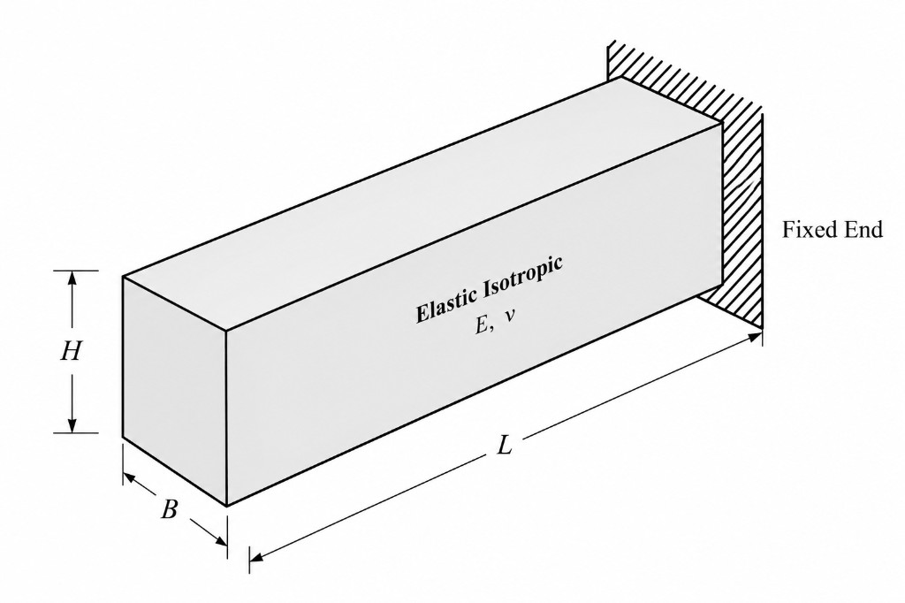
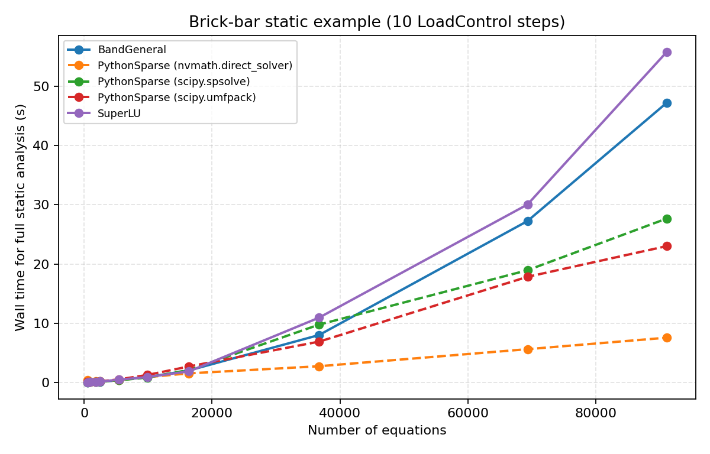
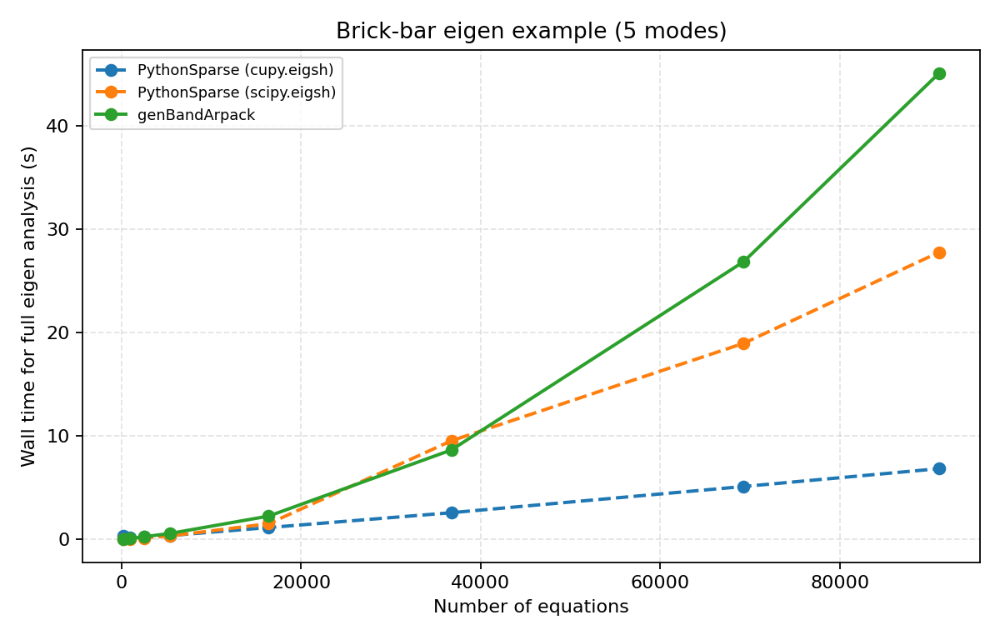

# Examples

The following example benchmarks the performance of some of the solvers available in this library versus the ones built into OpenSees. The benchmarks are performed on a 3-D solid mesh of a cantilever beam, similar to the one used on this
[OpenSees Digital post](https://openseesdigital.com/2021/12/19/three-dimensional-meshing/).
The bar is 10 in long, 1 in thick, and 2 in tall (kip–in–sec units). One end is fixed in
all directions.



The mesh is built with `ops.block3D` and `stdBrick` elements. The mesh density is controlled
by a **mesh factor** $f$: element size along the short cross-section directions is
$t / f$ where $t$ is the bar thickness, which sets the brick counts along $x$, $y$, and $z$.

```python
import math
import openseespy.opensees as ops

BAR_LENGTH = 10.0
BAR_HEIGHT = 2.0
BAR_THICKNESS = 1.0

def mesh_counts(factor):
    mesh_size = BAR_THICKNESS / factor
    nx = max(1, int(math.ceil(BAR_LENGTH / mesh_size)))
    ny = max(1, int(math.ceil(BAR_THICKNESS / mesh_size)))
    nz = max(1, int(math.ceil(BAR_HEIGHT / mesh_size)))
    return nx, ny, nz

def build_model(nx, ny, nz):
    ops.wipe()
    ops.model("basic", "-ndm", 3, "-ndf", 3)
    ops.nDMaterial("ElasticIsotropic", 1, 29_000.0, 0.3, 0.284e-3 / 386.4)
    ops.block3D(
        nx, ny, nz, 1, 1, "stdBrick", 1,
        1, 0.0, -BAR_THICKNESS / 2.0, -BAR_HEIGHT / 2.0,
        2, BAR_LENGTH, -BAR_THICKNESS / 2.0, -BAR_HEIGHT / 2.0,
        3, BAR_LENGTH, BAR_THICKNESS / 2.0, -BAR_HEIGHT / 2.0,
        4, 0.0, BAR_THICKNESS / 2.0, -BAR_HEIGHT / 2.0,
        5, 0.0, -BAR_THICKNESS / 2.0, BAR_HEIGHT / 2.0,
        6, BAR_LENGTH, -BAR_THICKNESS / 2.0, BAR_HEIGHT / 2.0,
        7, BAR_LENGTH, BAR_THICKNESS / 2.0, BAR_HEIGHT / 2.0,
        8, 0.0, BAR_THICKNESS / 2.0, BAR_HEIGHT / 2.0,
    )
    ops.fixX(0.0, 1, 1, 1)
```

Timings were measured on one laptop; expect different ordering and absolute times on other
platforms.

| | |
|--|--|
| **OS** | Windows 11 (build 26200) |
| **CPU** | 11th Gen Intel Core i7-11800H @ 2.30 GHz (8 cores, 16 threads) |
| **GPU** | NVIDIA GeForce RTX 3050 Ti Laptop GPU (4 GB VRAM) |
| **NVIDIA driver** | 591.74 |
| **Python** | 3.12.5 |
| **OpenSeesPy** | 3.8.0 with `scipy`, UMFPACK, and CUDA 13 / nvmath backends |

## Linear static analysis

### Analysis setup

A static analysis is run for an increasing load over **10** `LoadControl` steps
($\mathrm{d}\lambda = 0.1$). More than one step cuts down variance in short run times; with
everything else held fixed, differences in wall time are dominated by the linear equation solver.

The native OpenSees solvers `BandGeneral` and `SuperLU` are compared with
`scipy.spsolve`, `scipy.umfpack`, and `nvmath.direct_solver` from this library.

```python
from openseespy_solvers.scipy import spsolve
from openseespy_solvers.nvmath import direct_solver

NUM_STEPS = 10

solver = spsolve()  # or direct_solver(), scipy.umfpack(), …

ops.system("PythonSparse", solver.to_openseespy())
ops.numberer("RCM")
ops.constraints("Plain")
ops.integrator("LoadControl", 1.0 / NUM_STEPS)
ops.algorithm("ModifiedNewton", "-FactorOnce") # avoids recomputing the factorization
ops.analysis("Static")

start = time.perf_counter()
status = ops.analyze(NUM_STEPS)
seconds = time.perf_counter() - start
```

Reported times are **wall-clock seconds for the full** `ops.analyze(NUM_STEPS)` call.

### Results



## Modal (eigen) analysis

The same bar mesh is used to solve the generalized eigenproblem
$(\mathbf{K} - \lambda \mathbf{M})\mathbf{\Phi} = \mathbf{0}$ for the five lowest-frequency modes.

### Analysis setup

```python
from openseespy_solvers.scipy import eigsh
from openseespy_solvers.cupy import eigsh as cupy_eigsh

NUM_MODES = 5
eig_solver = eigsh() # or cupy_eigsh()

start = time.perf_counter()
lam = ops.eigen("PythonSparse", NUM_MODES, eig_solver.to_openseespy())
# lam = ops.eigen(NUM_MODES) # use the built-in banded ARPACK solver
seconds = time.perf_counter() - start
```

Reported times are **wall-clock seconds for the full** `ops.eigen(...)` call.

### Results



## See also

- [Tutorial](getting-started.md)
- [Installation](installation.md)
- [User guide](user-guide/index.md)
