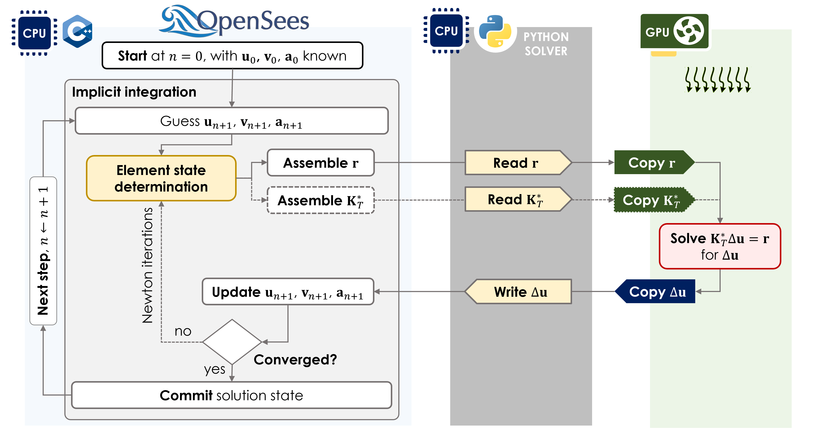

# PythonSparse interface

OpenSeesPy passes sparse matrix data to solver objects as memoryviews. Solvers
in this package wrap those buffers with NumPy, assemble a backend sparse matrix,
invoke the numerical routine, and write results in place.

## Linear solve

OpenSees calls `solver.solve(**kwargs)`.

**Keyword arguments**

`index_ptr`, `indices`, `values`
: CSR/CSC sparse structure and coefficients.

`rhs`, `x`
: Right-hand side and solution buffers. `x` is overwritten.

`num_eqn`, `nnz`
: Matrix order and number of nonzeros.

`matrix_status`
: One of `'STRUCTURE_CHANGED'`, `'COEFFICIENTS_CHANGED'`, `'UNCHANGED'`.

`storage_scheme`
: `'CSR'` or `'CSC'`. Default is `'CSR'`.

**Returns**

`0` if the solve succeeded; a negative integer otherwise. Set `debug=True` on
the solver to re-raise the underlying exception.

## Eigen solve

OpenSees calls `solver.solve(**kwargs)` for eigen analysis.

Additional keyword arguments: `k_values`, `m_values`, `eigenvalues`,
`eigenvectors`, `num_modes`, `find_smallest`.

Eigen solvers raise on failure; they do not return a status code.

## formAp

Linear solvers implement `formAp(**kwargs)` to compute `Ap = A @ p` without a
full solve. OpenSees supplies read-only `p` and writable `Ap`.

## Matrix status

OpenSees indicates how the system matrix changed since the previous solve:

`STRUCTURE_CHANGED`
: Rebuild the sparse matrix (new index structure).

`COEFFICIENTS_CHANGED`
: Update coefficients in place; sparsity pattern unchanged.

`UNCHANGED`
: Reuse the cached matrix. Direct solvers also reuse the LU factorization.

## Serial OpenSeesPy and parallelism {#parallelism}

These solvers work with **serial OpenSeesPy** — the standard build where the full
analysis pipeline runs on **one process**. That includes state determination, element
and nodal assembly, constraint handling, convergence tests, and the call into
`PythonSparse` with the assembled stiffness (and mass, for eigen).

The diagram above is a typical **nonlinear static/transient** step with a GPU direct or
iterative backend:

1. **OpenSees (CPU, C++)** — Newton loop: element state determination, assemble residual
   `r` and effective tangent `K_T*`, update displacements when converged.
2. **Python solver (CPU, Python)** — `PythonSparse` callback reads `r` and `K_T*`
   from OpenSees memoryviews, orchestrates the backend, writes `Δu` back.
3. **GPU (optional)** — copy `r` and `K_T*` host→device, solve
   `K_T* Δu = r`, copy `Δu` device→host. scipy/UMFPACK paths stay on the CPU instead
   of the third column.

Eigen analysis follows the same split: OpenSees assembles **K** and **M** on the CPU; the
solver object runs ARPACK, LOBPCG, or shift-invert on CPU and/or GPU depending on the
factory you choose.

This package does **not** support parallel or MPI OpenSeesPy builds where the model
is partitioned across processes. `PythonSparse` callbacks always run in the same
process that owns the model.

**Where parallelism exists today**

| Layer | Behavior |
|-------|----------|
| OpenSees model pipeline | Serial (single CPU process) |
| scipy backends (`spsolve`, `cg`, `eigsh`, …) | CPU linear algebra; may use multithreaded BLAS/LAPACK inside scipy/UMFPACK |
| cupy / nvmath backends | **GPU** factorization, iterative solve, or eigen iteration; matrix assembly still happens on the CPU in OpenSees, with host↔device transfers inside the solver |

So a GPU setup speeds up the **sparse solve step**, not domain decomposition or
multi-rank OpenSees analysis.

## See Also

[solver objects](solver-objects.md), [to_openseespy()](to-openseespy.md)

[OpenSees PythonSparse documentation](https://opensees.github.io/OpenSeesDocumentation/user/manual/analysis/system/PythonSparse.html)
